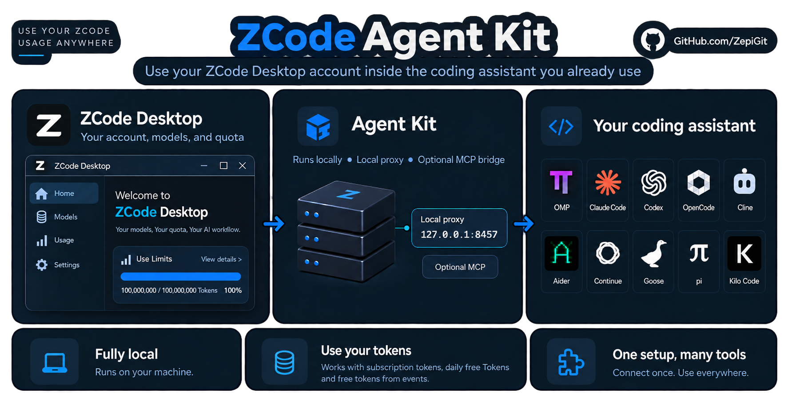

# ZCode Agent Kit
[English (original)](README.md) · **Deutsch** · [Español](README.es.md) · [日本語](README.ja.md) · [简体中文](README.zh-CN.md)

Nutze dein ZCode-Konto mit dem Coding-Assistenten, den du bereits verwendest.



*Das Kit läuft lokal; Modellanfragen gehen an ZCode.*

Behalte deinen Coding-Assistenten. Nutze deine vorhandenen ZCode-Modelle und dein Kontingent über eine lokale Verbindung.

**Optionale Kontorotation:** Der Installer fragt **"Do you want to activate the Account Rotator feature? [y/n]"**. Mit `y` wird der aktuelle Login übernommen; spätere Anmeldungen über `zcode-kit auth login zai` werden als zusätzliche Konten gespeichert. Eine erneute Anmeldung als bereits gespeicherter Nutzer aktualisiert normalerweise dessen Eintrag; die Dokumentation erklärt, wie Nutzer zugeordnet werden, und nennt die Ausnahmen. Später aktivieren mit `zcode-kit accounts enable`; gespeicherte Konten mit `zcode-kit accounts` anzeigen. `zcode-kit accounts health [--json]` zeigt auf Abruf je Konto ein Urteil aus Abrechnungsdaten. Das ist kein Beleg, dass Modellanfragen funktionieren; ein Konto ohne Kontingentdaten gilt nicht als gesund, und Konten werden nicht fortlaufend abgefragt. Siehe die [Dokumentation zum Account Rotator](docs/ACCOUNT_ROTATOR.de.md).

**Der Ablauf:** Konto vorbereiten → Kit installieren → GLM-5.3(-flash) verwenden und loslegen.

## Schritt 1 — Voraussetzungen prüfen

- [ZCode Desktop](https://zcode.z.ai/en), angemeldet mit deinem eigenen Konto und verfügbarem Modellkontingent.
- [Node.js 20 oder neuer](https://nodejs.org/). In einem neuen Terminal mit `node --version` prüfen.
- Ein separat installierter Coding-Assistent. Das Kit verbindet ihn mit ZCode.


## Schritt 2 — Kit einmal installieren

Wähle unten den Release-Installer oder npm. Der Release-Installer richtet erkannte Assistenten automatisch ein; danach ist kein separater Setup-Befehl nötig.

Der Installer zeigt vier nummerierte Schritte, kompakte Ergebnisse pro Assistent und eine Verbindungsprüfung. Ausführliche Setup-Ausgaben stehen in der angezeigten `install.log`; mit `ZCODE_KIT_VERBOSE=1` siehst du die vollständige Ausgabe und mit `NO_COLOR=1` einfachen Text. Bei interaktiver Installation muss der Account Rotator mit `y` oder `n` beantwortet werden. Für unbeaufsichtigte Installationen setze `ZCODE_KIT_ACCOUNT_ROTATOR=y` oder `n`; ohne ausdrückliche Antwort bleibt die bisherige Einstellung erhalten. Eine fehlgeschlagene Verbindungsprüfung bleibt eine Warnung, auch wenn die Installation erfolgreich war.

> **Bevor du den Installer ausführst:** Er lädt ein Skript herunter und führt es aus, ändert die Konfiguration erkannter Assistenten und kann MCP-Tools registrieren. Das Setup versucht außerdem eine kleine Modellanfrage, die Kontingent verbrauchen kann. Änderungen werden protokolliert; bei einem späteren Fehler können frühere Änderungen dennoch bestehen bleiben. Prüfe den Installer, falls deine Sicherheitsrichtlinien es verlangen.

**Windows — PowerShell, ohne Administratorrechte:**

```powershell
irm https://github.com/ZepiGit/ZCode-Agent-Kit/releases/latest/download/install.ps1 | iex
```

**macOS / Linux — POSIX-Terminal:**

```sh
curl -fsSL https://github.com/ZepiGit/ZCode-Agent-Kit/releases/latest/download/install.sh | sh
```

Der Aufruf funktioniert aus jedem Verzeichnis. Du musst das Repository nicht klonen. Der Installer führt das Setup aus und kann Bun installieren, falls es fehlt. Unter Windows PowerShell verwenden, nicht Git Bash oder WSL.

<details>
<summary>Installationsorte und Voraussetzungen für macOS/Linux</summary>

Standardorte: `%LOCALAPPDATA%\zcode-agent-kit` unter Windows; `$HOME/.local/share/zcode-agent-kit` unter macOS/Linux. Halte dieses Verzeichnis von deinen Projekten getrennt. Gib niemals dein Home-Verzeichnis oder einen Quellcode-Checkout als Installationsziel an: Updates ersetzen Dateien im Zielverzeichnis.

macOS/Linux benötigen außerdem `curl`, `tar` und ein SHA-256-Werkzeug; zum Einrichten von Bun ist `unzip` nötig, für Updates `rsync`. Die aktuelle Prüfung mit realen Clients konzentriert sich auf Windows; siehe die datierte [Support-Matrix](SUPPORT_MATRIX.json).

</details>

**Alternative — npm (Windows, macOS und Linux):**

Benötigt Node.js 20+ und [Bun](https://bun.sh/docs/installation), bereits installiert und im Terminal verfügbar (`bun --version`; getestet mit Bun 1.4.2).

```sh
npm install -g zcode-agent-kit@latest
zcode-kit setup --harness auto --installer
```

npm installiert die Befehle `zcode-kit` und `zcode-agent-kit`. Der zweite Befehl installiert die Kit-Abhängigkeiten, richtet erkannte Assistenten ein und stellt die y/n-Frage zum Account Rotator. Führe ihn nach der npm-Installation aus. Bleibe bei einer Installationsmethode, damit Befehl, Konfiguration und Proxy zur selben Kit-Kopie gehören.

## Schritt 3 — GLM-5.3(-flash) im gewünschten Assistenten verwenden

Öffne ein neues Terminal und rufe `zcode-kit help` auf. Öffne anschließend ein Terminal **in deinem eigenen Projekt**, nicht im Kit-Verzeichnis. Wähle deinen installierten Assistenten:

**OMP:**

```sh
omp -p --model zcode/glm-5.3-flash "Reply with ok"
```

**Claude Code:**

```sh
zcode-kit run claude-code -- -p "Reply with ok" --model glm-5.3-flash
```

**Codex:**

```sh
zcode-kit run codex -- exec "Reply with ok" -m glm-5.3-flash
```

Diese Befehle starten oder prüfen den Proxy automatisch. Eine Antwort mit `ok` bestätigt den ersten Modellaufruf. Eine Erfolgsmeldung des Setups allein tut das nicht.

**Antwort erhalten?** Dein Konto, der Proxy und der gewählte Assistent haben für diese Anfrage zusammengearbeitet. Du kannst diesen Assistenten jetzt in deinem Projekt verwenden.

**Keine Antwort?** Nutze die Prüfungen unter „Hilfe“; eine erneute Installation behebt kein aufgebrauchtes Kontingent.

## Schritt 4 — Im eigenen Projekt arbeiten

Für eine interaktive OMP-Sitzung:

```sh
omp --model zcode/glm-5.3-flash
```

Für eine interaktive Claude-Code-Sitzung:

```sh
zcode-kit run claude-code -- --model glm-5.3-flash
```

Wähle `glm-5.3` für Text oder `glm-5.3-flash` für Text und Bilder. Die Bildunterstützung hängt auch von deinem Assistenten ab. Eine optionale MCP-Bridge stellt Werkzeuge der installierten ZCode-Laufzeit bereit; ihre Registrierung verbindet noch kein Modell.

Flash verwendet immer Thinking. Anfragen mit deaktiviertem Thinking werden auf `low` normalisiert; ausdrücklich gewähltes `high` und `max` bleiben erhalten. In OMP wählst du die Stufe mit `--thinking low`, `--thinking high` oder `--thinking max`. Vollständig abgeschlossene Modellantworten mit Flash wurden über den direkten Proxy und Claude Code geprüft; das bedeutet nicht, dass jeder Assistent erfolgreich getestet wurde.

<details>
<summary>Weitere Assistenten und Grenzen der Integration</summary>

| Assistent | Was nach dem Setup zu tun ist |
| --- | --- |
| OpenCode | `zcode-kit run opencode -- .` ausführen und ein ZCode-Modell wählen. |
| Aider | `zcode-kit run aider -- --model openai/glm-5.3-flash` ausführen. |
| pi | Proxy manuell starten, dann `pi --model zcode/glm-5.3` ausführen. |
| Goose | Proxy manuell starten, dann `goose session --provider zcode` ausführen. |
| Continue | Continue zuerst öffnen/konfigurieren. `zcode-kit integrate continue` ausführen, Proxy starten und das Modell in der Oberfläche auswählen. |
| Cline / Kilo Code | Generierte Werte in die Erweiterung übernehmen und Proxy starten. Das Setup erzeugt `generated/cline-zcode-values.md` oder `generated/kilo-zcode-values.md` innerhalb einer Release-Installation. |

OMP direkt starten, nicht über `zcode-kit run`. Nur Claude Code, Codex, Aider und OpenCode haben Kit-Launcher. Codex verwendet ein isoliertes Profil; deine üblichen Einstellungen und Skills werden nicht automatisch übernommen. Die Claude-Code-Anbindung ist eine Community-Kompatibilitätslösung. Ein Adapter garantiert nicht, dass jede Client-Version live getestet wurde.

Siehe die [Dokumentation für Assistenten](harnesses/README.de.md) und die [Support-Matrix](SUPPORT_MATRIX.json).

</details>

<details>
<summary>Proxy manuell starten, stoppen oder neu starten</summary>

Dieselben Befehle funktionieren auf jeder Plattform sowie für Release- und npm-Installationen:

```sh
zcode-kit proxy start
zcode-kit proxy status
zcode-kit proxy logs 50
zcode-kit proxy restart
zcode-kit proxy stop
```

`stop`, `restart` und jeder automatische Neustart unterbrechen verbundene Clients und laufende Anfragen; wiederhole diese Anfragen danach. Releases ohne `zcode-kit proxy` rufen `node <Installation>/proxy/zcode-proxy-manager.mjs` mit demselben Befehl auf.

**Hängender Proxy:** `start`, `restart` und `stop` beenden einen nicht antwortenden Proxy nur, wenn er nachweislich zu diesem Kit gehört: Die Startfrist von 60 Sekunden ist abgelaufen, seine Startzeit stimmt mit der aufgezeichneten überein, seine Befehlszeile ist die des Kit-Proxys, und 3 aufeinanderfolgende Gesundheitsprüfungen (etwa 25 Sekunden) schlagen fehl. Ein Prozess mit unbekanntem Besitzer wird nie beendet; der Befehl meldet ihn und bricht ab. `zcode-kit doctor --fix` wendet die verwaltete Konfiguration erneut an und startet den Proxy auf dieselbe Weise, wenn er nicht läuft oder nachweislich hängt.

**Automatische Neustarts:** Reagiert der Hauptthread des Proxys nicht mehr oder bleibt sein Speicherverbrauch zu hoch, fordert der Proxy beim Kit-Manager einen neuen Start an. Innerhalb von 15 Minuten werden höchstens 3 solcher Neustarts angenommen; danach, oder wenn der Neustartverlauf unlesbar ist, wird die Anforderung abgelehnt und der Proxy bleibt aus, bis du `zcode-kit proxy logs 50` prüfst und ihn startest. Eine zurückgebliebene Startsperre wird absichtlich nie übernommen: Läuft kein Start, entferne die in der Meldung genannte Sperrdatei und versuche es erneut.

</details>

## Hilfe

```sh
zcode-kit doctor
zcode-kit auth status
```

- **Befehl nicht gefunden:** Terminal neu öffnen. Bei Release-Installationen prüfen, ob `%LOCALAPPDATA%\Microsoft\WindowsApps` (Windows) oder `$HOME/.local/bin` (macOS/Linux) im PATH steht.
- **Keine Modellantwort:** Desktop-Login und verfügbares Kontingent prüfen. Proxy starten, wenn dein Assistent ihn nicht startet. Eine lokale Gesundheitsprüfung beweist keinen Modellzugriff.
- **Proxy aus oder antwortet nicht:** `zcode-kit doctor --fix` oder `zcode-kit proxy restart` ausführen. Beendet wird nur ein nachweislich eigener, hängender Proxy; siehe den Abschnitt zum manuellen Proxy-Betrieb oben.
- **OMP-Autostart:** OMP direkt starten. Das Setup fixiert natives Node/Bun; die Erweiterung führt die Vorprüfung in einem neuen Kindprozess aus, statt Kit-Module in OMP zu importieren. Fehler melden Kategorien ohne Geheimnisse; der Kindprozess ist auf 120 Sekunden begrenzt. Ursache beheben und nach der sitzungsbezogenen Wartezeit von 60 Sekunden erneut versuchen; eine Wiederherstellung ist in derselben Sitzung möglich. Wurde die Laufzeit verschoben, `zcode-kit setup --harness auto` erneut ausführen und die Erweiterung neu laden. Unbekannte Portbesitzer bleiben unberührt.
- **Desktop-Login importieren:** Mit `zcode-kit auth login zai --import` den aktuell aktiven `zai`/`start-plan`-Login aus Desktop 0.16.9 importieren; ein ausdrücklich konfigurierter Plan ist erforderlich. Ist `credentials.json` vorhanden, ist diese Datei maßgeblich: Bei ungültigen Anmeldedaten erfolgt kein stiller Rückgriff auf die alte `config.json`. Moderne `coding-plan`-Logins verwenden stattdessen den normalen OAuth-Ablauf mit `zcode-kit auth login zai`; der Importer erstellt oder ermittelt keine API-Schlüssel.
- **401 oder Port belegt:** Auf eine weitere Kit-Installation prüfen. Weder Schlüssel löschen noch einen unbekannten Prozess beenden.
- **Setup teilweise fehlgeschlagen:** Den ausgegebenen Rollback-Befehl lesen, bevor du es erneut versuchst. Frühere Änderungen können noch vorhanden sein.

## Bevor du echte Projektdaten verwendest

Lass den Proxy nur auf localhost laufen und gib `.proxykey`, Anmeldedaten oder generierte Konfigurationsdateien niemals weiter.

**Lies die [Sicherheitsrichtlinie (English)](SECURITY.md) und die [deutsche Übersetzung](SECURITY.de.md):** Der verwaltete Proxy kann CAPTCHA-JavaScript des Anbieters ohne Betriebssystem-Sandbox ausführen. Er ist nur auf Loopback erreichbar und durch einen Bearer-Key geschützt, aber diese Maßnahmen isolieren den Prozess nicht. Der CAPTCHA-Worker-Thread hält den Proxy reaktionsfähig; er ist weder eine Sandbox noch eine neue Berechtigungsgrenze. Damit werden keine Kontobeschränkungen umgangen und der Erfolg jeder Prüfung ist nicht garantiert.

<details>
<summary>Kit aktualisieren oder entfernen</summary>

**Update:**

- Jede Installation: `zcode-kit update` ausführen. Eine Release-Installation lädt das neueste Release, prüft es (SHA-256), aktualisiert direkt im Verzeichnis und behält Proxy-Schlüssel, Konfiguration, Logs, Backups und Konten; eine npm-Installation führt das npm-Install erneut aus; ein Git-Checkout macht einen Fast-forward auf `origin/main`. Version festlegen mit `zcode-kit update --version vX.Y.Z`.
- Manueller Rückweg: denselben Release-Installer mit demselben dedizierten Ziel erneut ausführen (eine alte `ZCODE_KIT_VERSION`-Fixierung entfernen, wenn du die neueste Version willst), oder bei npm `npm install -g zcode-agent-kit@latest` und danach `zcode-kit setup --harness auto --installer` aus dieser npm-Installation.

`update` stoppt den Proxy, bevor es Dateien anfasst, und startet ihn danach neu — ist der Befehl erfolgreich, läuft der Proxy mit dem aktualisierten Code. Bleibe beim Aktualisieren bei derselben Installationsmethode.

**Integrationen entfernen:** Proxy anhalten (`zcode-kit proxy stop`, siehe oben), dann `zcode-kit uninstall` ausführen. Installationsverzeichnis, Abhängigkeiten, Logs, Proxy-Schlüssel und gemeinsame Anmeldedaten bleiben erhalten; du wirst nicht aus Desktop abgemeldet. Verbliebene Dateien prüfen, bevor du etwas löschst.

Bei einer npm-Installation anschließend das globale Paket mit `npm uninstall -g zcode-agent-kit` entfernen.

</details>

## Weitere Informationen

[Assistenten-Anleitungen](harnesses/README.de.md) · [Support-Matrix](SUPPORT_MATRIX.json) · [Sicherheitsrichtlinie (Deutsch)](SECURITY.de.md) · [Problem melden](https://github.com/ZepiGit/ZCode-Agent-Kit/issues) · [Komponentenmanifest (Deutsch)](MANIFEST.de.md) · [English](MANIFEST.md)
