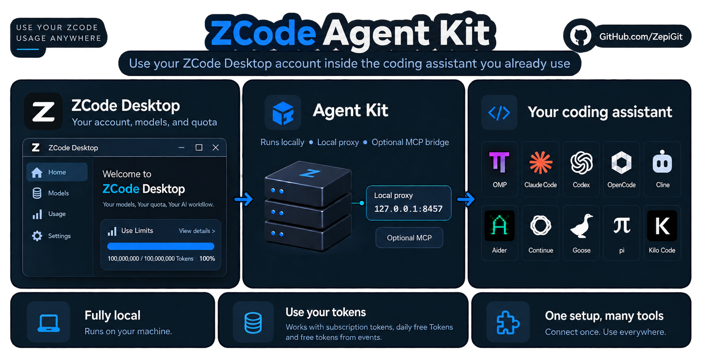

# ZCode Agent Kit
[English (original)](README.md) · [Deutsch](README.de.md) · **Español** · [日本語](README.ja.md) · [简体中文](README.zh-CN.md)

Usa tu cuenta de ZCode con el asistente de programación que ya utilizas.



*El kit se ejecuta localmente; las solicitudes a los modelos se envían a ZCode.*

Conserva tu asistente de programación. Usa tus modelos y tu cuota de ZCode mediante una conexión local. Dos vías equivalentes: deja que el kit configure un asistente detectado después de responder `y` para él, o copia tú mismo la URL base y la clave API mostradas en cualquier cliente compatible con OpenAI o Anthropic.

**Rotación de cuentas opcional:** El instalador pregunta **"Do you want to activate the Account Rotator feature? [y/n]"**. Si respondes `y`, se importa la sesión actual y los inicios de sesión posteriores con `zcode-kit auth login zai` se guardan como cuentas adicionales. Volver a iniciar sesión como un usuario ya guardado normalmente actualiza su registro; la documentación explica cómo se identifican los usuarios y las excepciones. Puedes activarla más adelante con `zcode-kit accounts enable` y consultar las cuentas guardadas con `zcode-kit accounts`. `zcode-kit accounts health [--json]` muestra bajo demanda un veredicto por cuenta a partir de los datos de facturación. No demuestra que las solicitudes al modelo funcionen; una cuenta sin datos de cuota no se considera sana y las cuentas no se consultan de forma continua. Consulta la [documentación de Account Rotator (en inglés)](docs/ACCOUNT_ROTATOR.md).

**El recorrido:** preparar tu cuenta → instalar el kit → usar GLM-5.3(-flash) y empezar a trabajar.

## Paso 1 — Comprueba los requisitos

- [ZCode Desktop](https://zcode.z.ai/en), con sesión iniciada en tu propia cuenta y cuota disponible para los modelos.
- [Node.js 20 o posterior](https://nodejs.org/). Compruébalo con `node --version` en una terminal nueva.
- Un asistente de programación instalado por separado. El kit lo conecta a ZCode.


## Paso 2 — Instala el kit una vez

Elige el instalador de la versión publicada o npm. El instalador ejecuta la configuración por ti, así que no hace falta ejecutar otro comando de configuración después. La configuración hace una pregunta por asistente detectado, **"Configure ZCode as a provider with its supported models in <HARNESS>? [y/n]"** (con el nombre del asistente), y solo cambia la configuración de ese asistente tras un `y`; `n` lo omite y deja sus ajustes intactos. Sin una respuesta en la terminal no se configura nada nuevo: un asistente solo se configura si lo seleccionas explícitamente (ver abajo) o ya diste tu consentimiento antes, y una integración que el kit creó antes de preguntar solo se mantiene al día.

El instalador muestra cuatro etapas numeradas, una línea de resultado por asistente (configurado, omitido o fallido), una prueba de conexión y los datos de conexión para configurar clientes manualmente. El resultado detallado de la configuración se guarda en el `install.log` indicado; usa `ZCODE_KIT_VERBOSE=1` para ver todo o `NO_COLOR=1` para texto sin formato. La instalación interactiva pregunta `y` o `n` por cada asistente y, por separado, por Account Rotator; Ctrl-C detiene las preguntas y deja intacto todo lo que no hayas respondido con `y`. Para instalaciones desatendidas, selecciona los asistentes explícitamente con `ZCODE_KIT_HARNESSES=omp,codex` (o `none`) y establece `ZCODE_KIT_ACCOUNT_ROTATOR=y` o `n`; sin una selección explícita, los asistentes sin decidir se omiten y se conserva la configuración existente de Account Rotator. Las respuestas se guardan en `generated/harness-choices/`: una configuración posterior, `update` o `zcode-kit doctor --fix` solo actualizan los asistentes que consentiste (un `y`, una selección explícita o `zcode-kit integrate <asistente>`) y nunca vuelven a integrar uno omitido; una integración que el kit creó antes de preguntar se mantiene al día, pero solo cuenta como consentimiento cuando respondes `y`. `zcode-kit setup --reask` vuelve a preguntar por cada asistente detectado en una terminal. Si falla la prueba de conexión, seguirá siendo una advertencia aunque la instalación haya terminado correctamente.

> **Antes de ejecutar el instalador:** descarga y ejecuta un script, modifica la configuración solo de los asistentes a los que respondes `y` y puede registrar herramientas MCP para ellos. La configuración también intenta hacer una pequeña solicitud al modelo que puede consumir cuota. Los cambios quedan registrados, pero un fallo posterior puede dejar en vigor cambios anteriores. Inspecciona el instalador si lo exige tu política de seguridad.

**Windows — PowerShell, sin permisos de administrador:**

```powershell
irm https://github.com/ZepiGit/ZCode-Agent-Kit/releases/latest/download/install.ps1 | iex
```

**macOS / Linux — terminal POSIX:**

```sh
curl -fsSL https://github.com/ZepiGit/ZCode-Agent-Kit/releases/latest/download/install.sh | sh
```

Puedes ejecutarlo desde cualquier directorio; no necesitas clonar el repositorio. El instalador realiza la configuración y puede instalar Bun si falta. En Windows usa PowerShell, no Git Bash ni WSL.

<details>
<summary>Ubicación de instalación y requisitos de macOS/Linux</summary>

Ubicaciones predeterminadas: `%LOCALAPPDATA%\zcode-agent-kit` en Windows; `$HOME/.local/share/zcode-agent-kit` en macOS/Linux. Mantén esta carpeta separada de tus proyectos. No uses tu carpeta personal ni una copia del código fuente como destino: las actualizaciones sustituyen los archivos del directorio elegido.

macOS/Linux también necesitan `curl`, `tar` y una utilidad SHA-256; para instalar Bun hace falta `unzip` y para actualizar, `rsync`. Las pruebas actuales con clientes reales se centran en Windows; consulta la [matriz de compatibilidad](SUPPORT_MATRIX.json), que incluye fechas.

</details>

**Alternativa — npm (Windows, macOS y Linux):**

Requiere Node.js 20+ y [Bun](https://bun.sh/docs/installation) ya instalados y disponibles en la terminal (`bun --version`; probado con Bun 1.4.2).

```sh
npm install -g zcode-agent-kit@latest
zcode-kit setup --harness auto --installer
```

npm instala los comandos `zcode-kit` y `zcode-agent-kit`. El segundo instala las dependencias del kit, hace una pregunta y/n por asistente detectado y después la pregunta y/n de Account Rotator. Ejecútalo después de instalar el paquete de npm. Usa un solo método de instalación para que el comando, la configuración y el proxy pertenezcan a la misma copia del kit.

## Paso 3 — Usa GLM-5.3(-flash) en el asistente que prefieras

Abre una terminal nueva y ejecuta `zcode-kit help`. Luego abre una terminal **dentro de tu propio proyecto**, no en la carpeta del kit. Elige el asistente que instalaste o usa los datos de conexión manual con cualquier otro cliente:

**Manual: URL base + clave API (cualquier cliente compatible con OpenAI o Anthropic)**

El kit no tiene que configurar tu asistente. Inicia el proxy local y copia los datos de conexión que imprime; `zcode-kit proxy status` los muestra de nuevo mientras el proxy está en ejecución:

```sh
zcode-kit proxy start
```

```text
Connection details (local ZCode proxy, running and verified)
  OpenAI-compatible base URL:    http://127.0.0.1:8457/v1   (POST /chat/completions, POST /responses, GET /models)
  Anthropic-compatible base URL: http://127.0.0.1:8457      (POST /v1/messages)
  API key (Bearer / x-api-key):  <tu clave local del proxy>
  Model IDs:                     glm-5.3, glm-5.3-flash
```

Introduce la URL base que corresponda al formato de API de tu cliente, la clave como clave API o token de autenticación y uno de los ID de modelo. La clave completa solo se imprime en una terminal interactiva; `zcode-kit models --show-key` la imprime para scripts, y `zcode-kit proxy status` marca los valores como no verificados mientras el proxy no está en ejecución. Esta vía sigue necesitando el proxy del kit y una sesión de ZCode con cuota; solo evita que el kit configure un asistente por ti. El puerto procede de tu `proxy/config.yaml`.

**OMP:**

```sh
omp -p --model zcode/glm-5.3-flash "Reply with ok"
```

**Claude Code:**

```sh
zcode-kit run claude-code -- -p "Reply with ok" --model glm-5.3-flash
```

**Codex:**

```sh
zcode-kit run codex -- exec "Reply with ok" -m glm-5.3-flash
```

Estos comandos inician o comprueban el proxy automáticamente. Una respuesta `ok` confirma que la primera solicitud al modelo funcionó. Un mensaje de configuración correcta, por sí solo, no lo confirma.

**¿Recibiste la respuesta?** Tu cuenta, el proxy y el cliente que elegiste funcionaron juntos para esa solicitud. Ya puedes usarlo en tu proyecto.

**¿No hubo respuesta?** Usa las comprobaciones de «Ayuda»; reinstalar no solucionará una cuota agotada.

## Paso 4 — Trabaja en tu proyecto

Para una sesión interactiva de OMP:

```sh
omp --model zcode/glm-5.3-flash
```

Para una sesión interactiva de Claude Code:

```sh
zcode-kit run claude-code -- --model glm-5.3-flash
```

Elige `glm-5.3` para texto o `glm-5.3-flash` para texto e imágenes. La compatibilidad con imágenes también depende del asistente. Un puente MCP opcional ofrece herramientas de la instalación local de ZCode; registrar el puente no equivale a conectar un modelo.

Flash siempre usa thinking. Las solicitudes que desactivan thinking se normalizan a `low`; se conservan `high` y `max` cuando se eligen explícitamente. En OMP, selecciona el nivel con `--thinking low`, `--thinking high` o `--thinking max`. Se han verificado respuestas completas de Flash mediante el proxy directo y Claude Code; esto no significa que todos los asistentes hayan superado las pruebas.

<details>
<summary>Otros asistentes y límites de integración</summary>

| Asistente | Qué hacer después de la configuración |
| --- | --- |
| OpenCode | Ejecuta `zcode-kit run opencode -- .` y selecciona un modelo de ZCode. |
| Aider | Ejecuta `zcode-kit run aider -- --model openai/glm-5.3-flash`. |
| pi | Inicia el proxy manualmente y ejecuta `pi --model zcode/glm-5.3`. |
| Goose | Inicia el proxy manualmente y ejecuta `goose session --provider zcode`. |
| Continue | Primero abre/configura Continue. Ejecuta `zcode-kit integrate continue`, inicia el proxy y elige el modelo en la interfaz. |
| Cline / Kilo Code | Tras un `y` para ese asistente, copia los valores generados a la interfaz de la extensión e inicia el proxy. La configuración crea entonces `generated/cline-zcode-values.md` o `generated/kilo-zcode-values.md` dentro de una instalación de la versión publicada. |

Ejecuta OMP directamente, sin `zcode-kit run`. Solo Claude Code, Codex, Aider y OpenCode tienen lanzadores del kit. Codex usa un perfil aislado: tus ajustes y skills habituales no se transfieren automáticamente. La integración con Claude Code es una solución de compatibilidad de la comunidad. Tener un adaptador no garantiza que cada cliente o versión se haya probado en vivo.

Consulta la [documentación de los asistentes](harnesses/README.es.md) y la [matriz de compatibilidad](SUPPORT_MATRIX.json).

</details>

<details>
<summary>Iniciar, detener o reiniciar el proxy manualmente</summary>

Los mismos comandos funcionan en todas las plataformas y en instalaciones de versión publicada y de npm:

```sh
zcode-kit proxy start
zcode-kit proxy status
zcode-kit proxy logs 50
zcode-kit proxy restart
zcode-kit proxy stop
```

`stop`, `restart` y cualquier reinicio automático interrumpen los clientes conectados y las solicitudes en curso; repite esas solicitudes después. Las versiones sin `zcode-kit proxy` ejecutan `node <instalación>/proxy/zcode-proxy-manager.mjs` con el mismo comando. `start` y `status` imprimen los datos de conexión (URL base, clave, ID de modelo) una vez que el proxy se verifica como el de esta instalación; un proxy detenido se informa como no en ejecución y sus valores configurados se etiquetan como tales.

**Proxy bloqueado:** `start`, `restart` y `stop` solo terminan un proxy que no responde cuando está demostrado que pertenece a este kit: ha pasado el periodo de gracia de arranque de 60 segundos, su hora de inicio coincide con la registrada, su línea de comandos es la del proxy del kit y fallan 3 comprobaciones de salud consecutivas (unos 25 segundos). Nunca se termina un proceso cuya propiedad se desconoce; el comando lo indica y se detiene. `zcode-kit doctor --fix` vuelve a aplicar la configuración gestionada y, si el proxy está detenido o bloqueado de forma demostrada, lo inicia del mismo modo.

**Reinicios automáticos:** si el hilo principal del proxy deja de responder o su memoria sigue demasiado alta, el proxy pide al gestor del kit un inicio nuevo. Se aceptan como máximo 3 reinicios de este tipo en 15 minutos; después, o si el historial de reinicios no se puede leer, la solicitud se rechaza y el proxy queda detenido hasta que revises `zcode-kit proxy logs 50` y lo inicies. Por diseño, nunca se toma el control de un bloqueo de inicio sobrante: si no hay ningún inicio en curso, elimina el archivo de bloqueo indicado en el mensaje y vuelve a intentarlo.

</details>

## Ayuda

```sh
zcode-kit doctor
zcode-kit auth status
```

- **No se encuentra el comando:** vuelve a abrir la terminal. En instalaciones de una versión publicada, comprueba que `%LOCALAPPDATA%\Microsoft\WindowsApps` (Windows) o `$HOME/.local/bin` (macOS/Linux) esté en PATH.
- **Asistente omitido durante la configuración:** responde `y` la próxima vez, ejecuta `zcode-kit integrate <asistente>` (`zcode-kit setup --harness <lista>` para varios) o `zcode-kit setup --reask` para que vuelva a preguntar por cada asistente detectado. Sin terminal, selecciona los asistentes con `ZCODE_KIT_HARNESSES`.
- **Configuración manual del cliente:** `zcode-kit proxy status` imprime las URL base, la clave y los ID de modelo mientras el proxy está en ejecución; la clave completa solo en una terminal interactiva (`zcode-kit models --show-key` en otro caso).
- **No responde el modelo:** comprueba la sesión de Desktop y la cuota disponible. Inicia el proxy si tu cliente no lo hace. Una comprobación de salud local no demuestra acceso al modelo.
- **Proxy detenido o sin respuesta:** ejecuta `zcode-kit doctor --fix` o `zcode-kit proxy restart`. Solo se termina un proxy bloqueado cuya propiedad por el kit esté demostrada; consulta la sección de gestión manual del proxy más arriba.
- **Autoarranque de OMP:** ejecuta OMP directamente. La configuración fija Node/Bun nativos; la extensión realiza la comprobación previa en un proceso hijo nuevo, sin importar módulos del kit en OMP. Los fallos muestran categorías sin secretos; el proceso hijo tiene un límite de 120 segundos. Corrige la causa indicada y reintenta tras los 60 segundos de espera por sesión; es posible recuperarse en la misma sesión. Si cambió la ubicación del runtime, ejecuta de nuevo `zcode-kit setup --harness auto` y recarga la extensión. No se modifican procesos desconocidos que ocupen el puerto.
- **Importar el login de Desktop:** ejecuta `zcode-kit auth login zai --import` para importar el login activo de `zai`/`start-plan` en Desktop 0.16.9; se requiere un plan configurado explícitamente. Si existe `credentials.json`, es la fuente autoritativa: unas credenciales inválidas no provocan una vuelta silenciosa al antiguo `config.json`. Los logins modernos de `coding-plan` usan el OAuth normal con `zcode-kit auth login zai`; el importador no crea ni obtiene claves API.
- **401 o puerto ocupado:** comprueba si existe otra instalación del kit. No borres claves ni termines un proceso que no reconoces.
- **La configuración falló a medias:** que falle un asistente no deshace los demás; sus propios cambios parciales se revierten y el instalador continúa con una advertencia. Lee el comando de rollback mostrado antes de volver a intentarlo. Es posible que queden cambios anteriores.

## Antes de usar datos reales del proyecto

Mantén el proxy en localhost y no compartas `.proxykey`, las credenciales ni los archivos de configuración generados.

**Lee la [política de seguridad (en inglés)](SECURITY.md); también está disponible en [alemán](SECURITY.de.md):** el proxy gestionado puede ejecutar JavaScript CAPTCHA del proveedor sin un entorno aislado del sistema operativo. Sigue limitado a loopback y protegido por clave bearer, pero estas medidas no aíslan el proceso. El hilo de trabajo (worker) de CAPTCHA mantiene el proxy receptivo; no es un entorno aislado ni un nuevo límite de permisos. Esto no elude restricciones de cuentas ni garantiza que todos los desafíos se resuelvan.

<details>
<summary>Actualizar o eliminar el kit</summary>

**Actualizar:**

- Cualquier instalación: ejecuta `zcode-kit update`. Una instalación de versión publicada descarga la versión más reciente, la verifica (SHA-256), se actualiza en el mismo directorio y conserva tu clave del proxy, configuración, registros, copias y cuentas; una instalación npm vuelve a ejecutar la instalación de npm; un checkout de git avanza rápido a `origin/main`. Fija una versión con `zcode-kit update --version vX.Y.Z`.
- Alternativa manual: vuelve a ejecutar el mismo instalador con el mismo destino específico (elimina una fijación anterior de `ZCODE_KIT_VERSION` si quieres la versión más reciente), o para npm ejecuta `npm install -g zcode-agent-kit@latest` y después `zcode-kit setup --harness auto --installer` desde esa instalación npm.

`update` detiene el proxy antes de tocar archivos y lo reinicia después — cuando el comando tiene éxito, el proxy ejecuta el código actualizado. Conserva el mismo método de instalación al actualizar.

**Quitar integraciones:** detén tu proxy (`zcode-kit proxy stop`, ver arriba) y ejecuta `zcode-kit uninstall`. Se conservan la carpeta de instalación, dependencias, registros, claves del proxy y credenciales compartidas; la sesión de Desktop sigue iniciada. Inspecciona los archivos restantes antes de borrar nada.

Si instalaste mediante npm, elimina después el paquete global con `npm uninstall -g zcode-agent-kit`.

</details>

## Más información

[Guías de asistentes](harnesses/README.es.md) · [Matriz de compatibilidad](SUPPORT_MATRIX.json) · [Política de seguridad (inglés)](SECURITY.md) · [Informar de un problema](https://github.com/ZepiGit/ZCode-Agent-Kit/issues) · [Manifiesto de componentes (inglés)](MANIFEST.md)
